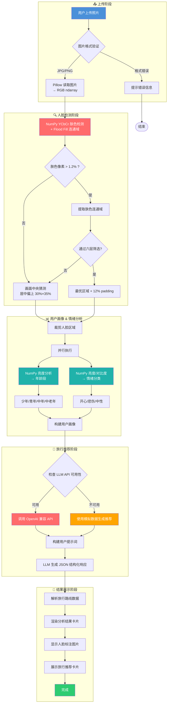

# TravelFace 项目流程图

## 完整流程图 (Mermaid)

## 模块说明

| 模块 | 技术栈 | 输入 | 输出 |
|------|--------|------|------|
| 人脸检测 | **NumPy** YCbCr 肤色 + Flood Fill | 原图 (RGB) | 最优人脸边界框 |
| 年龄分析 | **NumPy** 亮度均值 | 人脸裁剪图 | 年龄段 |
| 性别分析 | **NumPy** RGB 通道比 (红润度) | 人脸裁剪图 | 性别 |
| 情绪识别 | **NumPy** 亮度 + 对比度 | 人脸裁剪图 | 情绪类别 + 置信度 |
| 旅行推荐 | LLM (OpenAI API) | 用户画像 + 情绪 | 结构化旅行路线 |

## 关键设计点

1. **零外部视觉依赖**：人脸检测、画像分析、情绪识别全部基于纯 NumPy + Pillow，无需下载任何模型权重
2. **YCbCr + Flood Fill**：先通过 YCbCr 色彩空间提取肤色掩膜，再用 Flood Fill 找连通域，最后六层筛选定位最优人脸
3. **智能降级**：肤色检测失败时自动走画面中央偏上猜测（30%×35%），确保非人脸图片也能运行
4. **双模式推荐**：LLM API 可用时动态生成路线，不可用时使用内置 12 条模拟推荐
5. **双主题 UI**：暗色/浅色模式自动适配，按钮 + Metric + 旅行卡片均带悬停放大动效
